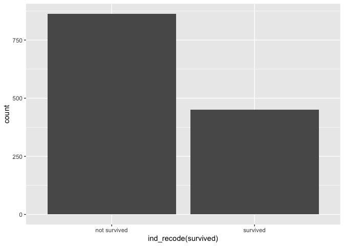
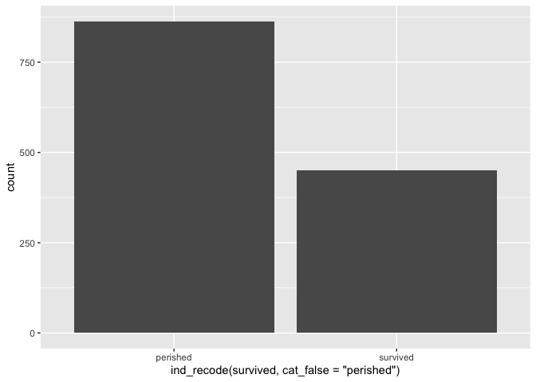
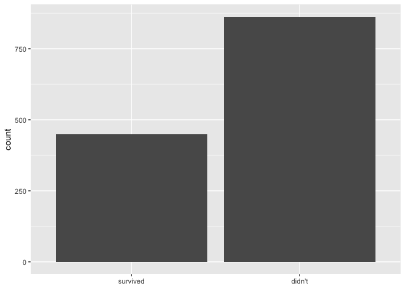
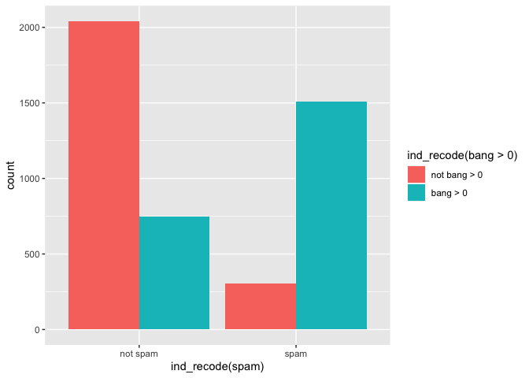
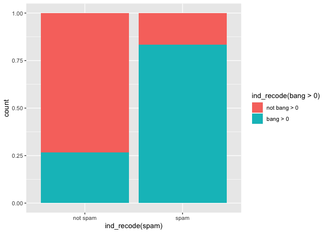

<!-- README.md is generated from README.Rmd. Please edit that file -->

# Abstract

<!-- badges: start -->

<!-- badges: end -->

{{ind2cat}} can help analysts translate from an indicator variables to
categorical variables that can be used in reporting products. By
default, the categorical variable is created from the indicator variable
name, resulting in a light weight syntax.

ind2cat’s ind\_recode function saves time by automatically creating
meaningful categories based on a variable name as shown below:

``` r
library(tidyverse)
#> ── Attaching core tidyverse packages ──────────────────────── tidyverse 2.0.0 ──
#> ✔ dplyr     1.1.0     ✔ readr     2.1.4
#> ✔ forcats   1.0.0     ✔ stringr   1.5.0
#> ✔ ggplot2   3.4.1     ✔ tibble    3.2.0
#> ✔ lubridate 1.9.2     ✔ tidyr     1.3.0
#> ✔ purrr     1.0.1     
#> ── Conflicts ────────────────────────────────────────── tidyverse_conflicts() ──
#> ✖ dplyr::filter() masks stats::filter()
#> ✖ dplyr::lag()    masks stats::lag()
#> ℹ Use the conflicted package (<http://conflicted.r-lib.org/>) to force all conflicts to become errors
library(indicatorrecode)

data.frame(ind_graduated = c(T,T,F)) |>
  mutate(cat_graduated  = ind_recode(ind_graduated))
#>   ind_graduated cat_graduated
#> 1          TRUE     graduated
#> 2          TRUE     graduated
#> 3         FALSE not graduated
```

This can replace the less succinct approach:

``` r
data.frame(ind_graduated = c(T,T,F)) |>
  mutate(cat_graduated  = ifelse(ind_graduated, 
                                 "graduated", 
                                 "not graduated")) |>
  mutate(cat_graduated = fct_rev(cat_graduated))  
#>   ind_graduated cat_graduated
#> 1          TRUE     graduated
#> 2          TRUE     graduated
#> 3         FALSE not graduated
```

# Background: *indicator variables a common and well understood way to store information.*

Indicator variables are often used in data analyses given the ease which
with they are created, stored and interpreted. They concisely encode
information about the presence or not of a condition for observational
units.

see.. <https://emilyriederer.netlify.app/post/column-name-contracts/>

In exploratory analyses indicator variables, analysts often make a
choice between crafting an categorical variable whose values preserve
the information that the indicator variable *name* holds, or using an
indicator variable as-is; the later choice may be motivated by time
savings.

# Problem: Direct use of indicator variables in data products.

When indicator variables are not translated to a categorical analogue in
creating data products like tables and visuals, information is often
awkwardly displayed and is sometimes lost.

``` r
library(tidyverse)

tidytitanic::passengers %>% 
  ggplot() + 
  aes(x = survived) + 
  geom_bar()
```

<div class="figure">


<p class="caption">

A. Bar labels + axis label preserves information but is awkward

</p>

</div>

``` r

tidytitanic::passengers %>% 
  count(survived) %>% 
  knitr::kable(caption = "B. Column header from variable name and 0-1 categories preserves information but is awkward")
```

| survived |   n |
| -------: | --: |
|        0 | 863 |
|        1 | 450 |

B. Column header from variable name and 0-1 categories preserves
information but is awkward

``` r


tidytitanic::passengers %>% 
  janitor::tabyl(sex, survived) %>% 
  knitr::kable(caption = "C. Information loss with a two-way table for column variables")
```

| sex    |   0 |   1 |
| :----- | --: | --: |
| female | 154 | 308 |
| male   | 709 | 142 |

C. Information loss with a two-way table for column variables

``` r

tidytitanic::passengers %>% 
ggplot() + 
  aes(x = sex) + 
  geom_bar() + 
  facet_grid(~ survived)
```

<div class="figure">


<p class="caption">

D. Facetting directly on an indicator variable with popular ggplot2
results in information loss

</p>

</div>

# One-off solution: *manual indicator recode, but is repetitive*

``` r
tidytitanic::passengers %>% 
  tibble() %>% 
  mutate(cat_survived = ifelse(survived, "survived", "not survived"), 
         .before = 1)
#> # A tibble: 1,313 × 6
#>    cat_survived name                                   class   age sex   survi…¹
#>    <chr>        <chr>                                  <chr> <dbl> <chr>   <int>
#>  1 survived     Allen, Miss Elisabeth Walton           1st   29    fema…       1
#>  2 not survived Allison, Miss Helen Loraine            1st    2    fema…       0
#>  3 not survived Allison, Mr Hudson Joshua Creighton    1st   30    male        0
#>  4 not survived Allison, Mrs Hudson JC (Bessie Waldo … 1st   25    fema…       0
#>  5 survived     Allison, Master Hudson Trevor          1st    0.92 male        1
#>  6 survived     Anderson, Mr Harry                     1st   47    male        1
#>  7 survived     Andrews, Miss Kornelia Theodosia       1st   63    fema…       1
#>  8 not survived Andrews, Mr Thomas, jr                 1st   39    male        0
#>  9 survived     Appleton, Mrs Edward Dale (Charlotte … 1st   58    fema…       1
#> 10 not survived Artagaveytia, Mr Ramon                 1st   71    male        0
#> # … with 1,303 more rows, and abbreviated variable name ¹​survived

tidytitanic::passengers %>% 
ggplot() + 
  aes(x = sex) + 
  geom_bar() + 
  facet_grid(~ ifelse(survived, "survived", "not survived"))
```


This solution above also does not address category display ordering;
ordering in products will be alphabetical and not reflect the F/T order
of the source variable. An additional step to reflect the source
variable, using a function like fct\_rev, may be required for
consistency in reporting.

``` r
data.frame(ind_daytime = c(T, F, T, T)) %>% 
    mutate(cat_survived = ifelse(ind_daytime, "daytime", "not daytime")) %>% 
  mutate(cat_survived = fct_rev(cat_survived)) %>% 
  ggplot() + 
  aes(x = cat_survived) + 
  geom_bar()
```


# Introducing ind\_recode *ind\_recode() function uses variable name as starting point for human-readable categories*

<!-- Usually I'll start with the sketch of a function right here, but then I eventually move it to an .R file. -->

``` r
#' ind_recode
#'
#' @param var the name of an indicator variable
#' @param var_prefix a character string that will be ignored when creating the categorical variable
#' @param negator a character string used to create cat_false when cat_false is NULL, default is 'not'
#' @param cat_true a character string string to be used place of  T/1/"Yes" for the categorical variable output, if NULL the category is automatically generated from the variable name
#' @param cat_false a character string string to be used place of  F/0/"No" for the categorical variable output, if NULL the category is automatically generated from the cat true and the negator
#' @param rev logical indicating if the order should be reversed from the F/T ordering of the indicator source variable, default is FALSE
#'
#' @return
#' @export
#'
#' @examples
#' library(tibble)
#' library(dplyr)
#' tibble(ind_grad = c(0,0,1,1,1 ,0 ,0)) %>%
#'   mutate(cat_grad  = ind_recode(ind_grad))
#'
#' tibble(ind_grad = c(TRUE,TRUE,FALSE)) %>%
#'   mutate(cat_grad  = ind_recode(ind_grad))
#'
#' tibble(ind_grad = c("Y", "N")) %>%
#'   mutate(cat_grad  = ind_recode(ind_grad))
#'
#' tibble(ind_grad = c("y", "n")) %>%
#'   mutate(cat_grad  = ind_recode(ind_grad))
#'
#' tibble(ind_grad = c("yes", "no")) %>%
#'   mutate(cat_grad  = ind_recode(ind_grad))
ind_recode <- function(var, var_prefix = "ind_", negator = "not",
                       cat_true = NULL, cat_false = NULL, rev = FALSE){

  if(is.null(cat_true)){
    cat_true = deparse(substitute(var)) %>%   # use r lang in rewrite
      stringr::str_remove(paste0("^", var_prefix)) %>%
      stringr::str_replace_all("_", " ")
  }

  if(is.null(cat_false)){
    cat_false = paste(negator, cat_true)
  }

  # for yes/no case
  if(is.character({{var}})){

    my_var <- {{var}} %>% as.factor() %>% as.numeric() - 1

  }else{

    my_var <- {{var}}
  }

  if(rev){
    ifelse(my_var, cat_true, cat_false) %>%
      factor(levels = c(cat_true, cat_false))
  }else{
    ifelse(my_var, cat_true, cat_false) %>%
      factor(levels = c(cat_false, cat_true))
  }


}
```

# to do

  - change to Rlang for grabbing function name
  - make “Y” “N” a lot stricter - right now we’re assuming a ton\!

# Basic examples: *How to use ind\_recode()*

``` r
library(tibble)
tibble(ind_grad = c(0,0,1,1,1 ,0 ,0)) %>%
  mutate(cat_grad  = ind_recode(ind_grad))
#> # A tibble: 7 × 2
#>   ind_grad cat_grad
#>      <dbl> <fct>   
#> 1        0 not grad
#> 2        0 not grad
#> 3        1 grad    
#> 4        1 grad    
#> 5        1 grad    
#> 6        0 not grad
#> 7        0 not grad

tibble(ind_grad = c(T,T,F)) %>%
  mutate(cat_grad  = ind_recode(ind_grad))
#> # A tibble: 3 × 2
#>   ind_grad cat_grad
#>   <lgl>    <fct>   
#> 1 TRUE     grad    
#> 2 TRUE     grad    
#> 3 FALSE    not grad

tibble(ind_grad = c("Y", "N")) %>%
  mutate(cat_grad  = ind_recode(ind_grad))
#> # A tibble: 2 × 2
#>   ind_grad cat_grad
#>   <chr>    <fct>   
#> 1 Y        grad    
#> 2 N        not grad

tibble(ind_grad = c("y", "n")) %>%
  mutate(cat_grad  = ind_recode(ind_grad))
#> # A tibble: 2 × 2
#>   ind_grad cat_grad
#>   <chr>    <fct>   
#> 1 y        grad    
#> 2 n        not grad

tibble(ind_grad = c("yes", "no")) %>%
  mutate(cat_grad  = ind_recode(ind_grad))
#> # A tibble: 2 × 2
#>   ind_grad cat_grad
#>   <chr>    <fct>   
#> 1 yes      grad    
#> 2 no       not grad
```

# Customizability

We believe that ind\_recode is useful in quickly translating to a human
understandable outcome.

However, addition functionality allows analysts to fully specify their
preferences about the categories outputted.

  - var\_prefix a character string that will be ignored when creating
    the categorical variable
  - negator a character string used to create cat\_false when cat\_false
    is NULL, default is ‘not’
  - cat\_true a character string string to be used place of T/1/“Yes”
    for the categorical variable output, if NULL the category is
    automatically generated from the variable name
  - cat\_false a character string string to be used place of F/0/“No”
    for the categorical variable output, if NULL the category is
    automatically generated from cat\_true and the negator
  - rev logical indicating if the order should be reversed from the F/T
    ordering of the indicator source variable, default is FALSE

## Customization examples

``` r
tibble(dummy_grad = c(0,0,1,1,1 ,0 ,0)) %>%
  mutate(cat_grad  = ind_recode(dummy_grad, var_prefix = "dummy_"))
#> # A tibble: 7 × 2
#>   dummy_grad cat_grad
#>        <dbl> <fct>   
#> 1          0 not grad
#> 2          0 not grad
#> 3          1 grad    
#> 4          1 grad    
#> 5          1 grad    
#> 6          0 not grad
#> 7          0 not grad

tibble(ind_grad = c(T,T,F)) %>%
  mutate(cat_grad  = ind_recode(ind_grad, negator = "didn't"))
#> # A tibble: 3 × 2
#>   ind_grad cat_grad   
#>   <lgl>    <fct>      
#> 1 TRUE     grad       
#> 2 TRUE     grad       
#> 3 FALSE    didn't grad

tibble(ind_grad = c("Y", "N")) %>%
  mutate(cat_grad  = ind_recode(ind_grad, cat_false = "enrolled"))
#> # A tibble: 2 × 2
#>   ind_grad cat_grad
#>   <chr>    <fct>   
#> 1 Y        grad    
#> 2 N        enrolled

tibble(ind_grad = c("y", "n")) %>%
  mutate(cat_grad  = ind_recode(ind_grad, 
                                cat_true = "graduated"))
#> # A tibble: 2 × 2
#>   ind_grad cat_grad     
#>   <chr>    <fct>        
#> 1 y        graduated    
#> 2 n        not graduated

tibble(ind_grad = c("y", "n")) %>%
  mutate(cat_grad  = ind_recode(ind_grad, 
                                cat_true = "graduated", 
                                cat_false = "enrolled"))
#> # A tibble: 2 × 2
#>   ind_grad cat_grad 
#>   <chr>    <fct>    
#> 1 y        graduated
#> 2 n        enrolled

tibble(ind_grad = c("yes", "no")) %>%
  mutate(cat_grad  = ind_recode(ind_grad, rev = TRUE)) %>% 
  mutate(cat_grad_num = as.numeric(cat_grad))
#> # A tibble: 2 × 3
#>   ind_grad cat_grad cat_grad_num
#>   <chr>    <fct>           <dbl>
#> 1 yes      grad                1
#> 2 no       not grad            2
```

## Use in data products like figures and tables

``` r
tidytitanic::passengers %>% 
ggplot() + 
  aes(x = ind_recode(survived)) + 
  geom_bar()
```



``` r

# or
last_plot() +
  aes(x = ind_recode(survived, cat_false = "perished"))
```



``` r

  
# or
last_plot() +
  aes(x = ind_recode(survived, cat_false = "didn't", rev = T)) + 
  labs(x = NULL)
```



``` r

tidytitanic::passengers %>% 
ggplot() + 
  aes(x = sex) + 
  geom_bar() + 
  facet_grid(~ ind_recode(survived))
```


# Known Limitations: *not for use with magrittr pipe (but base pipe works\!)*

``` r
tidytitanic::passengers %>% 
ggplot() + 
  aes(x = sex) + 
  geom_bar() + 
  facet_grid(~ survived %>% ind_recode())
```


``` r

tidytitanic::passengers %>% 
ggplot() + 
  aes(x = sex) + 
  geom_bar() + 
  facet_grid(~ survived |> ind_recode())
```


-----

Afterward

# Other questions: *1) Is there already a solution and 2) fundamental problems with this approach?*

Please lemme know ’em\!

-----

# worked example with tidytuesday data, Spam email

<https://github.com/rfordatascience/tidytuesday/tree/master/data/2023/2023-08-15>

``` r
read.csv("https://raw.githubusercontent.com/rfordatascience/tidytuesday/master/data/2023/2023-08-15/spam.csv") %>% 
  rename(spam = yesno) %>% 
  ggplot() + 
  aes(fill = ind_recode(bang>0), x = ind_recode(spam)) + 
  geom_bar(position = "dodge")
```



``` r

remove_layers <- function(plot, index = NULL){
  
  if(is.null(index)){
  plot$layers <- NULL
  }else{
  plot$layers[[index]] <- NULL
  }
  
 plot
  
}

last_plot_wiped <- function(index = NULL){
  
  plot <- last_plot()
  
  if(is.null(index)){
  plot$layers <- NULL
  }else{
  plot$layers[[index]] <- NULL
  }
  
 plot
  
}

last_plot_wiped() +
  geom_bar(position = "fill")
```

 \#
learned along the way: `as_factor()` has different behavior than
`as.factor()`

``` r
c("Y", "N") %>% as_factor()
#> [1] Y N
#> Levels: Y N
c("Y", "N") %>% as.factor()
#> [1] Y N
#> Levels: N Y
```
