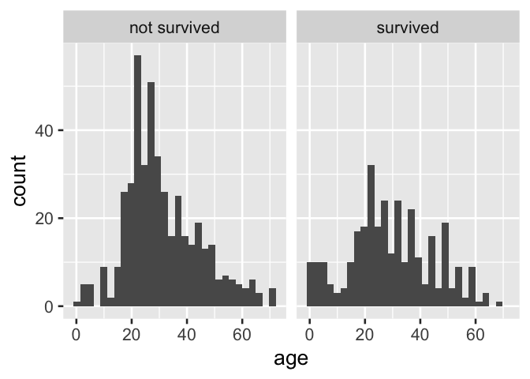
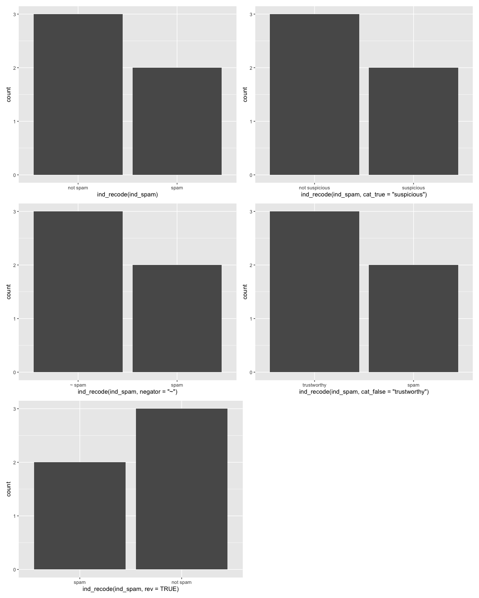

<!-- README.md is generated from README.Rmd. Please edit that file -->

<!-- badges: start -->

<!-- badges: end -->

# Abstract

Indicator variables are easy to create, store, and interpret
\[@10.1177/1536867X19830921\]. They concisely encode information about
the presence of a condition for observational units. The variable name
encapsulates the information about the condition of interest, and the
variable’s values (TRUE and FALSE, 1 or 0, “Yes” or “No”) indicate if
the condition is met for the observational unit. When using indicator
variables to use in summary products, analysts often make a choice
between using an indicator variable as-is or crafting categorical
variables where values can be directly interpreted. Using the indicator
variable as-is may be motivated by time savings, but yields poor results
in summary products. {{ind2cat}} can help analysts concisely translate
indicator variables to categorical variables for reporting products,
yielding more polished outputs. By default, ind2cat creates the
categorical variable from the indicator variable name, resulting in a
light weight syntax.

<!-- see.. https://emilyriederer.netlify.app/post/column-name-contracts/ -->

# Issues up front

## disclosures

0)  ind2cat is experimental
1)  I’m not sure if there there is already a solution
2)  unsure if there are fundamental problems with this approach

## to do to move ind2cat out of proof of concept phase

  - change to Rlang for grabbing function name (Claus Wilke)
  - left join instead of ifelse to make code more performant (Emily
    Rederer)
  - make “Y” “N” a lot stricter - right now we’re assuming a ton\!
    Danger.

# Introduction

Using current analytic tools, analysts make a choice between directly
using indicator variables or recoding the variable first to categorical.
Current procedures for recoding indicator variables to a categorical
variable is repetitive, but forgoing a recode and using indicator
variables directly yields hard-to-interpret summary products.

The data below inspired by email training data, demonstrates how an
analyst might current recode an indicator variable. This method is
repetitive; in the recoding line, ‘spam’ is typed four times.

``` r
library(tidyverse)
data.frame(spam = c(TRUE, TRUE, FALSE, FALSE, TRUE)) %>% 
  mutate(cat_spam = ifelse(spam, "spam", "not spam"))
#>    spam cat_spam
#> 1  TRUE     spam
#> 2  TRUE     spam
#> 3 FALSE not spam
#> 4 FALSE not spam
#> 5  TRUE     spam
```

Likewise, in data visualization products, we see how repetitive recoding
can be in the Titanic data example that follows.

``` r
tidytitanic::passengers %>% 
ggplot() + 
  aes(x = age) + 
  geom_histogram() + 
  facet_grid(~ ifelse(survived, 
                      "survived", 
                      "not survived")) 
```



This ifelse() approach to recoding above also has the disadvantage of
not consistently ordering the resultant categories; ordering in products
will be alphabetical and not reflect the F/T order of the source
variable. An additional step to reflect the source variable, using a
function like forcats::fct\_rev, may be required for consistent
reporting.

``` r
data.frame(ind_grad = c(T, F, T, T)) %>% 
    mutate(cat_grad = ifelse(ind_grad, "grad", "not grad")) %>% 
  mutate(cat_grad = fct_rev(cat_grad)) %>% 
  ggplot() + 
  aes(x = cat_grad) + 
  geom_bar()
```


Given how verbose recoding an indicator variable can be, analysts may
choose to forego a recoding the variable, especially in exploratory
analysis.

However, when indicator variables are used directly in data summary
products like tables and visuals, information is often awkwardly
displayed and is sometimes lost.

Below, the table that is created by using the indicator variable
directly is awkward to interpret. The indicator variable name persists
in the output allowing savvy readers to interpret the output, but
communication is strained.

``` r
tidytitanic::passengers %>% 
  count(survived) 
#>   survived   n
#> 1        0 863
#> 2        1 450
```

In the following two-way table produced using an indicator variable
directly with the popular janitor package, information is completely
lost:

``` r
tidytitanic::passengers %>% 
  janitor::tabyl(sex, survived)
#>     sex   0   1
#>  female 154 308
#>    male 709 142
```

Likewise, in the following visual summary of the data, where an
indicator variable is directly used, interpretation is awkward.

``` r
library(tidyverse)

tidytitanic::passengers %>% 
  ggplot() + 
  aes(x = survived) + 
  geom_bar()
```

<div class="figure">


<p class="caption">

A. Bar labels + axis label preserves information but is awkward

</p>

</div>

Moreover, when indicator variables are used directly as faceting
variable for plots produced by the popular ggplot2 library, information
is lost and the plot is not directly interpretable.

``` r
tidytitanic::passengers %>% 
ggplot() + 
  aes(x = age) + 
  geom_histogram() + 
  facet_grid(~ survived)
```

<div class="figure">


<p class="caption">

D. Facetting directly on an indicator variable with popular ggplot2
results in information loss

</p>

</div>

# Introducing ind2cat::ind\_recode

The ind2cat::ind\_recode() function uses indicator variable names to
automatically derive human-readable, and appropriately ordered
categories.

<!-- Usually I'll start with the sketch of a function right here, but then I eventually move it to an .R file. -->

To clearly compare the new method, we reiterate the status quo with a
toy example:

``` r
library(tidyverse)

data.frame(ind_graduated = 
             c(TRUE, TRUE, FALSE))  %>% 
  mutate(cat_graduated  = 
           ifelse(ind_graduated, 
                  "graduated", 
                  "not graduated"))  %>% 
  mutate(cat_graduated = 
           fct_rev(cat_graduated)
         )  
#>   ind_graduated cat_graduated
#> 1          TRUE     graduated
#> 2          TRUE     graduated
#> 3         FALSE not graduated
```

Below we contrast this with the use of ind2cat’s ind\_recode function
which avoids repetition by creating categories based on the indicator
variable name. Using the the function ind\_recode(), we can accomplish
the same task shown above more succinctly:

``` r
library(ind2cat)

data.frame(ind_graduated = 
             c(TRUE, TRUE, FALSE)) %>% 
  mutate(cat_graduated  = 
           ind_recode(ind_graduated)
         )
#>   ind_graduated cat_graduated
#> 1          TRUE     graduated
#> 2          TRUE     graduated
#> 3         FALSE not graduated
```

The function ind\_recode is flexible, and can recode from variable
populated with TRUE/FALSE values as well as 1/0 or “Yes”/“No” (and
variants ‘y/n’ for example).

Furthermore, while ind\_recode default functionality allows analysts to
move from its first-cut human-readable recode, it also allows fully
customized categories via adjustment of the functions parameters.

  - cat\_true a character string string to be used place of T/1/“Yes”
    for the categorical variable output, if NULL the category is
    automatically generated from the variable name

  - negator a character string used to create cat\_false when cat\_false
    is NULL, default is ‘not’

  - cat\_false a character string string to be used place of F/0/“No”
    for the categorical variable output, if NULL the category is
    automatically generated from cat\_true and the negator

  - rev logical indicating if the order should be reversed from the F/T
    ordering of the indicator source variable, default is FALSE

  - var\_prefix a character string that will be ignored when creating
    the categorical variable

<!-- end list -->

``` r
data.frame(ind_graduated = c(T,T,F)) %>% 
  mutate(cat_graduated  = ind_recode(ind_graduated, 
                                     cat_false = "current"))
#>   ind_graduated cat_graduated
#> 1          TRUE     graduated
#> 2          TRUE     graduated
#> 3         FALSE       current
```

``` r

tibble(ind_grad = c("y", "n")) %>%
  mutate(cat_grad  = ind_recode(ind_grad, 
                                cat_true = "graduated"))
#> # A tibble: 2 × 2
#>   ind_grad cat_grad     
#>   <chr>    <fct>        
#> 1 y        graduated    
#> 2 n        not graduated
```

``` r

tibble(ind_grad = c(T,T,F)) %>%
  mutate(cat_grad  = ind_recode(ind_grad, negator = "didn't"))
#> # A tibble: 3 × 2
#>   ind_grad cat_grad   
#>   <lgl>    <fct>      
#> 1 TRUE     grad       
#> 2 TRUE     grad       
#> 3 FALSE    didn't grad
```

``` r
tibble(ind_grad = c("Y", "N")) %>%
  mutate(cat_grad  = ind_recode(ind_grad, cat_false = "enrolled"))
#> # A tibble: 2 × 2
#>   ind_grad cat_grad
#>   <chr>    <fct>   
#> 1 Y        grad    
#> 2 N        enrolled
```

``` r
tibble(ind_grad = c("yes", "no")) %>%
  mutate(cat_grad  = ind_recode(ind_grad, rev = TRUE)) %>% 
  mutate(cat_grad_num = as.numeric(cat_grad))
#> # A tibble: 2 × 3
#>   ind_grad cat_grad cat_grad_num
#>   <chr>    <fct>           <dbl>
#> 1 yes      grad                1
#> 2 no       not grad            2
```

``` r
tibble(dummy_grad = c(0,0,1,1,1 ,0 ,0)) %>%
  mutate(cat_grad  = ind_recode(dummy_grad, var_prefix = "dummy_"))
#> # A tibble: 7 × 2
#>   dummy_grad cat_grad
#>        <dbl> <fct>   
#> 1          0 not grad
#> 2          0 not grad
#> 3          1 grad    
#> 4          1 grad    
#> 5          1 grad    
#> 6          0 not grad
#> 7          0 not grad
```

## Use in data products like figures and tables

In what follows, we show ind2cat’s use in summary products, which is a
main motivation for ind2cat.

``` r
tidytitanic::passengers %>% 
ggplot() + 
  aes(x = ind_recode(survived)) + 
  geom_bar()
```



``` r
# or
last_plot() +
  aes(x = ind_recode(survived, cat_false = "perished"))
```


``` r
# or
last_plot() +
  aes(x = ind_recode(survived, cat_false = "didn't", rev = T)) + 
  labs(x = NULL)
```


``` r

tidytitanic::passengers %>% 
ggplot() + 
  aes(x = sex) + 
  geom_bar() + 
  facet_grid(~ ind_recode(survived))
```


``` r
tidytitanic::passengers %>%
  mutate(cat_survived = ind_recode(survived)) %>% 
  janitor::tabyl(sex, cat_survived) %>% 
  janitor::adorn_percentages() %>% 
  janitor::adorn_pct_formatting() %>% 
  janitor::adorn_ns(position = "rear")
#>     sex not survived    survived
#>  female  33.3% (154) 66.7% (308)
#>    male  83.3% (709) 16.7% (142)
```

# Conclusion

# Implementation details

``` r
readLines("R/ind_recode.R") -> implementation
```

``` r
#' ind_recode
#'
#' @param var the name of an indicator variable
#' @param var_prefix a character string that will be ignored when creating the categorical variable
#' @param negator a character string used to create cat_false when cat_false is NULL, default is 'not'
#' @param cat_true a character string string to be used place of  T/1/"Yes" for the categorical variable output, if NULL the category is automatically generated from the variable name
#' @param cat_false a character string string to be used place of  F/0/"No" for the categorical variable output, if NULL the category is automatically generated from the cat true and the negator
#' @param rev logical indicating if the order should be reversed from the F/T ordering of the indicator source variable, default is FALSE
#'
#' @return
#' @export
#'
#' @examples
#' library(tibble)
#' library(dplyr)
#' tibble(ind_grad = c(0,0,1,1,1 ,0 ,0)) %>%
#'   mutate(cat_grad  = ind_recode(ind_grad))
#'
#' tibble(ind_grad = c(TRUE,TRUE,FALSE)) %>%
#'   mutate(cat_grad  = ind_recode(ind_grad))
#'
#' tibble(ind_grad = c("Y", "N")) %>%
#'   mutate(cat_grad  = ind_recode(ind_grad))
#'
#' tibble(ind_grad = c("y", "n")) %>%
#'   mutate(cat_grad  = ind_recode(ind_grad))
#'
#' tibble(ind_grad = c("yes", "no")) %>%
#'   mutate(cat_grad  = ind_recode(ind_grad))
ind_recode <- function(var, var_prefix = "ind_", negator = "not",
                       cat_true = NULL, cat_false = NULL, rev = FALSE){

  if(is.null(cat_true)){
    cat_true = deparse(substitute(var)) %>%   # use r lang in rewrite
      stringr::str_remove(paste0("^", var_prefix)) %>%
      stringr::str_replace_all("_", " ")
  }

  if(is.null(cat_false)){
    cat_false = paste(negator, cat_true)
  }

  # for yes/no case
  if(is.character({{var}})){

    my_var <- {{var}} %>% as.factor() %>% as.numeric() - 1

  }else{

    my_var <- {{var}}
  }

  if(rev){
    ifelse(my_var, cat_true, cat_false) %>%
      factor(levels = c(cat_true, cat_false))
  }else{
    ifelse(my_var, cat_true, cat_false) %>%
      factor(levels = c(cat_false, cat_true))
  }


}
```

-----

# README.Rmd chunks names

``` r
knitr::knit_code$get() |> names()
#>  [1] "setup"                                
#>  [2] "manipulation_status_quo"              
#>  [3] "visual_status_quo"                    
#>  [4] "visual_status_quo_order"              
#>  [5] "direct_table_awkward"                 
#>  [6] "direct_table_loss"                    
#>  [7] "direct_visual_awkward"                
#>  [8] "direct_visual_loss"                   
#>  [9] "manipulation_status_quo_reprise"      
#> [10] "manipulation_ind2cat"                 
#> [11] "manipulation_ind2cat_custom"          
#> [12] "manipulation_ind2cat_cat_true"        
#> [13] "manipulation_ind2cat_negator"         
#> [14] "manipulation_ind2cat_false_cat"       
#> [15] "manipulation_ind2cat_rev"             
#> [16] "manipulation_ind2cat_prefix"          
#> [17] "visual_ind2cat_improves"              
#> [18] "visual_ind2cat_improves_cat_false"    
#> [19] "visual_ind2cat_improves_cat_false_rev"
#> [20] "visual_ind2cat_preserves"             
#> [21] "table_ind2cat_preserves"              
#> [22] "unnamed-chunk-1"                      
#> [23] "unnamed-chunk-2"                      
#> [24] "unnamed-chunk-3"
```
