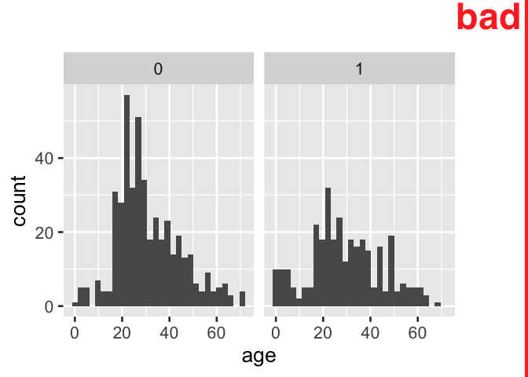

<!-- README.md is generated from README.Rmd. Please edit that file -->

# indicatorrecode

<!-- badges: start -->

<!-- badges: end -->

The goal of indicatorrecode is to …

# Context: *indicator variables well understood*

  - <https://emilyriederer.netlify.app/post/column-name-contracts/>

# Problem: *content loss using indicator variables directly in data products*

``` r
library(tidyverse)
#> ── Attaching core tidyverse packages ──────────────────────── tidyverse 2.0.0 ──
#> ✔ dplyr     1.1.0     ✔ readr     2.1.4
#> ✔ forcats   1.0.0     ✔ stringr   1.5.0
#> ✔ ggplot2   3.4.1     ✔ tibble    3.2.0
#> ✔ lubridate 1.9.2     ✔ tidyr     1.3.0
#> ✔ purrr     1.0.1     
#> ── Conflicts ────────────────────────────────────────── tidyverse_conflicts() ──
#> ✖ dplyr::filter() masks stats::filter()
#> ✖ dplyr::lag()    masks stats::lag()
#> ℹ Use the conflicted package (<http://conflicted.r-lib.org/>) to force all conflicts to become errors

tidytitanic::passengers %>% 
  ggplot() + 
  aes(x = survived) + 
  geom_bar()
```


``` r

tidytitanic::passengers %>% 
  count(survived)
#>   survived   n
#> 1        0 863
#> 2        1 450

tidytitanic::passengers %>% 
  janitor::tabyl(sex, survived)
#>     sex   0   1
#>  female 154 308
#>    male 709 142

tidytitanic::passengers %>% 
ggplot() + 
  aes(x = sex) + 
  geom_bar() + 
  facet_grid(~ survived)
```


# One-off solution: *manual indicator recode, but is repetitive*

addition downside is unanticipated reordering depending on value of true
case v. false case category

``` r
tidytitanic::passengers %>% 
  tibble() %>% 
  mutate(cat_survived = ifelse(survived, "survived", "not survived"), 
         .before = 1)
#> # A tibble: 1,313 × 6
#>    cat_survived name                                   class   age sex   survi…¹
#>    <chr>        <chr>                                  <chr> <dbl> <chr>   <int>
#>  1 survived     Allen, Miss Elisabeth Walton           1st   29    fema…       1
#>  2 not survived Allison, Miss Helen Loraine            1st    2    fema…       0
#>  3 not survived Allison, Mr Hudson Joshua Creighton    1st   30    male        0
#>  4 not survived Allison, Mrs Hudson JC (Bessie Waldo … 1st   25    fema…       0
#>  5 survived     Allison, Master Hudson Trevor          1st    0.92 male        1
#>  6 survived     Anderson, Mr Harry                     1st   47    male        1
#>  7 survived     Andrews, Miss Kornelia Theodosia       1st   63    fema…       1
#>  8 not survived Andrews, Mr Thomas, jr                 1st   39    male        0
#>  9 survived     Appleton, Mrs Edward Dale (Charlotte … 1st   58    fema…       1
#> 10 not survived Artagaveytia, Mr Ramon                 1st   71    male        0
#> # … with 1,303 more rows, and abbreviated variable name ¹​survived

tidytitanic::passengers %>% 
ggplot() + 
  aes(x = sex) + 
  geom_bar() + 
  facet_grid(~ ifelse(survived, "survived", "not survived"))
```



# Proposed many-times solution: *ind\_recode() function uses variable name as starting point for creating true and false human understandable categories*

``` r
ind_recode <- function(var, var_prefix = "ind_", negator = "not", cat_true = NULL, cat_false = NULL, rev = FALSE){
  
  if(is.null(cat_true)){
    cat_true = deparse(substitute(var)) %>% 
      str_remove(paste0("^", var_prefix)) %>% 
      str_replace_all("_", " ")
  }
  
  if(is.null(cat_false)){
    cat_false = paste(negator, cat_true)
  }
  
  # for yes/no case
  if(is.character({{var}})){
    
    my_var <- {{var}} %>% as.factor() %>% as.numeric() - 1
    
  }else{
      
    my_var <- {{var}}
    }
    
      if(rev){
    ifelse(my_var, cat_true, cat_false) %>% 
      factor(levels = c(cat_true, cat_false))
  }else{
    ifelse(my_var, cat_true, cat_false) %>% 
      factor(levels = c(cat_false, cat_true))
  }
    

}

tibble(ind_female = c(0,0,1,1,1 ,0 ,0)) %>% 
  mutate(cat_female  = ind_recode(ind_female))
#> # A tibble: 7 × 2
#>   ind_female cat_female
#>        <dbl> <fct>     
#> 1          0 not female
#> 2          0 not female
#> 3          1 female    
#> 4          1 female    
#> 5          1 female    
#> 6          0 not female
#> 7          0 not female

tibble(ind_female = c(T,T,F)) %>% 
  mutate(cat_female  = ind_recode(ind_female))
#> # A tibble: 3 × 2
#>   ind_female cat_female
#>   <lgl>      <fct>     
#> 1 TRUE       female    
#> 2 TRUE       female    
#> 3 FALSE      not female

tibble(ind_female = c("Y", "N")) %>% 
  mutate(cat_female  = ind_recode(ind_female))
#> # A tibble: 2 × 2
#>   ind_female cat_female
#>   <chr>      <fct>     
#> 1 Y          female    
#> 2 N          not female

tibble(ind_female = c("y", "n")) %>% 
  mutate(cat_female  = ind_recode(ind_female))
#> # A tibble: 2 × 2
#>   ind_female cat_female
#>   <chr>      <fct>     
#> 1 y          female    
#> 2 n          not female

tibble(ind_female = c("yes", "no")) %>% 
  mutate(cat_female  = ind_recode(ind_female))
#> # A tibble: 2 × 2
#>   ind_female cat_female
#>   <chr>      <fct>     
#> 1 yes        female    
#> 2 no         not female
```

# Examples: *How to use ind\_recode()*

``` r
tidytitanic::passengers %>% 
  tibble() %>% 
  mutate(cat_survived = ind_recode(survived))
#> # A tibble: 1,313 × 6
#>    name                                        class   age sex   survi…¹ cat_s…²
#>    <chr>                                       <chr> <dbl> <chr>   <int> <fct>  
#>  1 Allen, Miss Elisabeth Walton                1st   29    fema…       1 surviv…
#>  2 Allison, Miss Helen Loraine                 1st    2    fema…       0 not su…
#>  3 Allison, Mr Hudson Joshua Creighton         1st   30    male        0 not su…
#>  4 Allison, Mrs Hudson JC (Bessie Waldo Danie… 1st   25    fema…       0 not su…
#>  5 Allison, Master Hudson Trevor               1st    0.92 male        1 surviv…
#>  6 Anderson, Mr Harry                          1st   47    male        1 surviv…
#>  7 Andrews, Miss Kornelia Theodosia            1st   63    fema…       1 surviv…
#>  8 Andrews, Mr Thomas, jr                      1st   39    male        0 not su…
#>  9 Appleton, Mrs Edward Dale (Charlotte Lamso… 1st   58    fema…       1 surviv…
#> 10 Artagaveytia, Mr Ramon                      1st   71    male        0 not su…
#> # … with 1,303 more rows, and abbreviated variable names ¹​survived,
#> #   ²​cat_survived

tidytitanic::passengers %>% 
ggplot() + 
  aes(x = ind_recode(survived)) + 
  geom_bar()
```


``` r

# or
last_plot() +
  aes(x = ind_recode(survived, cat_false = "perished"))
```


``` r

  
# or
last_plot() +
  aes(x = ind_recode(survived, cat_false = "didn't", rev = T)) + 
  labs(x = NULL)
```


``` r

tidytitanic::passengers %>% 
ggplot() + 
  aes(x = sex) + 
  geom_bar() + 
  facet_grid(~ ind_recode(survived))
```


# Known Limitations: *not for use with magrittr pipe (but base pipe works\!)*

``` r
tidytitanic::passengers %>% 
ggplot() + 
  aes(x = sex) + 
  geom_bar() + 
  facet_grid(~ survived %>% ind_recode())
```


``` r

tidytitanic::passengers %>% 
ggplot() + 
  aes(x = sex) + 
  geom_bar() + 
  facet_grid(~ survived |> ind_recode())
```


# Other questions: *1) Is there already a solution and 2) fundamental problems with this approach?*

Please lemme know ’em\!

# example with tidytuesday data, Spam email

<https://github.com/rfordatascience/tidytuesday/tree/master/data/2023/2023-08-15>

``` r
read.csv("https://raw.githubusercontent.com/rfordatascience/tidytuesday/master/data/2023/2023-08-15/spam.csv") %>% 
  rename(spam = yesno) %>% 
  ggplot() + 
  aes(fill = ind_recode(bang>0), x = ind_recode(spam)) + 
  geom_bar(position = "dodge")
```


``` r

remove_layers <- function(plot, index = NULL){
  
  if(is.null(index)){
  plot$layers <- NULL
  }else{
  plot$layers[[index]] <- NULL
  }
  
 plot
  
}

read.csv("https://raw.githubusercontent.com/rfordatascience/tidytuesday/master/data/2023/2023-08-15/spam.csv") %>% 
  rename(spam = yesno) %>% 
  ggplot() + 
  aes(fill = ind_recode(bang>0), x = ind_recode(spam)) + 
  geom_bar(position = "dodge") -> 
  p; p |> remove_layers() +
  geom_bar(position = "fill")
```


